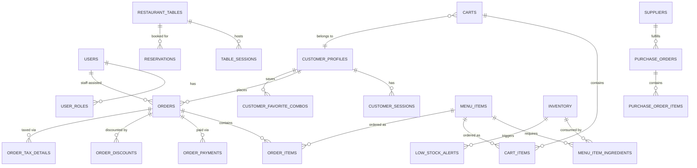
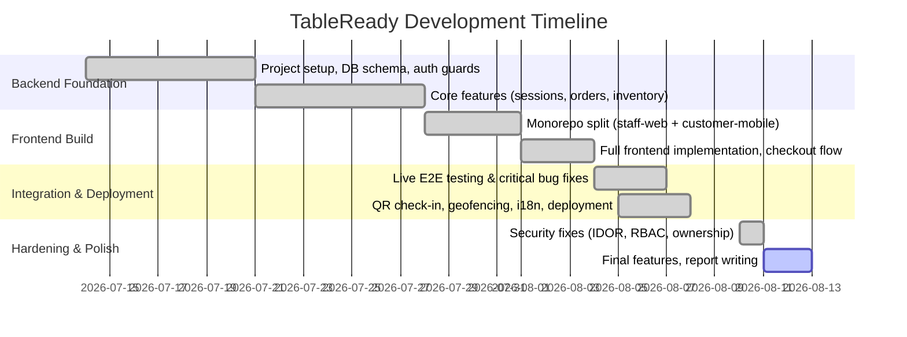

# CHAPTER 4 — SYSTEM DESIGN

## 4.1 Architecture Design
Three-tier, client-server architecture:
- **Presentation:** two independent clients — Staff Web (React/Vite, browser) and
  Customer Mobile (React Native/Expo) — both consuming the same REST API and sharing
  business logic via the `@table-ready/shared` npm workspace package.
- **Application/API:** single Node.js/Express server (`backend/`) exposing REST
  endpoints under `/api` plus a Socket.IO server for real-time push events.
- **Data:** PostgreSQL 15, accessed via the `pg` driver, no ORM (raw SQL in
  controllers/services) — schema in `backend/src/config/init.sql`.
- **Third-party:** Stripe (payments), deployed on Render (backend as a web service,
  staff web as a static site, managed Postgres).

*(TODO: draw this as a simple box diagram — Customer App / Staff Web → REST + WebSocket → Express API → PostgreSQL, with Stripe off to the side. A 10-minute draw.io diagram is enough.)*

## 4.2 Data Flow Design
Example flow — placing a dine-in order (trace this yourself against the code to confirm accuracy):
1. Customer scans table QR / enters PIN → `POST /tables/verify`
2. Customer adds items → `POST /cart/:id/items` (validated against `menu_items`, price looked up server-side)
3. Customer checks out → `POST /cart/:id/checkout` → server creates `orders` + `order_items` rows in a transaction, deducts `inventory` stock via `menu_item_ingredients`, creates a Stripe PaymentIntent
4. Server emits `new_kitchen_order` over WebSocket → Kitchen Display updates live
5. Kitchen updates status → `PATCH /orders/:id/status` → server emits `order_status_updated`
6. Customer's `OrderTrackingScreen` (subscribed via `join_order`) updates live

*(TODO: a formal DFD (Level 0/1) diagram — draw.io or Lucidchart — using the steps above as your labeled data flows.)*

## 4.3 Database Design

### 4.3.1 ER Diagram (core entities — simplified for readability)
Full 50-table schema is documented in
[03-database-documentation.md](03-database-documentation.md); a report-scale diagram
should show the core order flow, not all 50 tables. Paste this into any Mermaid-capable
tool (or a Mermaid live editor) to render it:

## 4.4 Use Case Diagram
Mermaid has no native UML use-case notation, so draw this formally in draw.io/
Lucidchart. Actor summary (each row's items become use-case bubbles):

| Actor | Key Use Cases |
|---|---|
| **Customer** | Register/sign in, Browse menu & customize, Check in to table (QR/PIN), Order (Pickup/Delivery/Dine-In/Order From Home), Release an Order-From-Home hold, Track order live, Join waitlist, Request assistance |
| **Waiter** | Help a customer who calls for assistance, Confirm a dine-in order was served ("Mark Served") |
| **Kitchen Staff** | Fulfill orders with full modifier/allergy visibility, advance status Received → Cooking → Ready |
| **Manager/Admin** | Manage menu items/photos/availability, Restock inventory, Configure branding/tax/delivery radius, Create staff accounts |
| **Driver** | *(role exists in schema/routes; no dedicated scenario documented in the SRS — note as a gap if asked)* |

### Detailed scenarios (integrated from your SRS.docx — quote directly as supporting narrative)

**1. Customer — Ordering (account required)**
Precondition: customer has the app open; if no session is stored, they must sign in/
register first — there is no browsing or ordering without an account. Flow: register or
sign in → browse menu, view images/prices/descriptions, add to cart → customize with
modifiers (additions, removals, prep notes) → checkout choosing a fulfillment type
(Pickup, Delivery, Dine-In with table number, or Order From Home) → order is created
and immediately trackable via a live status progress bar. Error handling: registering
with an already-registered email is rejected with a clear error; a wrong password is
rejected without revealing whether the email exists at all, to avoid leaking which
addresses are registered. Result: every order ties back to the customer's account,
enabling order history and future reorder features.

**2. Customer — Pre-Ordering ("Order From Home") and releasing the hold**
Precondition: signed-in customer has items in cart. Flow: checkout choosing "Order From
Home" → order created with ON_HOLD status, invisible to the kitchen queue → customer
opens their tracking screen when ready and releases the hold → status changes to
Received and is pushed to the kitchen queue instantly.

**3. Customer — Checking into a dine-in table**
Precondition: customer is physically at the restaurant with a table assigned. Flow:
scan the table's QR code, or enter the table number + 4-digit code manually → app
verifies the code against the table's assigned code → customer is routed into the menu
with the table number already attached, so checkout automatically becomes a dine-in
order for that table.

**4. Customer — Joining the waitlist**
Precondition: customer wants a table but none are available. Flow: open the Waitlist
screen, join with party size and contact info → staff see the live waitlist on the
floor dashboard and seat parties as tables open up.

**5. Customer — Requesting assistance**
Precondition: customer is seated at a dine-in table. Flow: tap a "Call Server" action,
optionally select a reason → request appears immediately on the assigned waiter's
dashboard (Alerts view) with the table number → waiter acknowledges/dismisses it, and
the update broadcasts live so a second waiter's screen doesn't keep showing an
already-handled request as pending.

**6. Waiter — Confirming a dine-in order was served**
Precondition: a dine-in order at one of the waiter's tables was marked Ready by the
kitchen. Flow: kitchen advances the order through prep stages and stops at Ready (no
kitchen-side "picked up" action exists for table orders) → waiter's dashboard reflects
Ready live → waiter delivers the food, taps "Mark Served" → status changes to Served
and clears from the kitchen's active queue. Result: an explicit, waiter-owned
confirmation that food actually reached the table — closing a gap where the kitchen
previously had no accountable hand-off.

**7. Kitchen Staff — Fulfilling orders with full modifier and allergy visibility**
Precondition: an order has been placed (and released, if it was an Order-From-Home
hold) and isn't on hold or already completed. Flow: new order ticket appears via
WebSocket the instant it's placed → every item shows its full name, quantity, and
modifiers resolved to real names → removal-type modifiers (e.g. "No Onions") are
visually flagged distinctly from additions → kitchen advances Received → In
Preparation → Cooking → Ready → for dine-in, the chain stops at Ready (waiting on the
waiter); for pickup/delivery/order-from-home, it continues through Ready for Pickup →
Picked Up.

**8. Manager/Admin — Managing menu items, photos, and availability**
Precondition: signed in as manager/admin. Flow: open Menu Management, create/edit an
item (name, category, description, price, prep time) → set a photo via URL or direct
upload → toggle an existing item out of stock, immediately hiding it from the
customer-facing menu.

**9. Manager/Admin — Restocking inventory**
Precondition: a delivery arrived or a stock count needs correcting upward. Flow: open
the Inventory panel, enter a quantity to add for a specific item → recorded stock level
increases and the change is logged.

**10. Manager/Admin — Configuring branding and staff access**
Flow: configure branding (colors, logo), tax rate, and delivery radius from Settings —
changes apply live on the customer app; create new staff accounts from Staff
Management — intentionally not self-service, to prevent anyone granting themselves
elevated access.

## 4.5 Gantt Chart
Built from your actual commit history (`git log`), grouped into phases — dates are
real, phase groupings are my best read of the commit clusters; adjust if your memory of
the actual work breakdown differs:

## 4.6 User Interface Design
*(TODO: needs real screenshots — see [06-user-manual.md](06-user-manual.md) for the
full page list to capture.)*

## 4.7 USER GUIDE
Reuse [06-user-manual.md](06-user-manual.md) content, split to match this template's
expected format:

**User Side**
1. Register and Log in — customer account creation / guest session via table check-in
2. Dashboard and browsing — menu, item detail, cart
3. Access all features quickly — bottom tab navigation (mobile) / sidebar (staff web)
4. History — Order History screen, "The Usual" reorder

**Admin Side**
- Admin Dashboard features — Manager Panel: menu management, promotions, staff
  scheduling, analytics/reports, tax config, audit logs, surge pricing

---
*TODO (you): render the mermaid diagrams above (any Mermaid live editor, or paste into
draw.io), draw the use-case diagram and architecture/DFD diagrams by hand from the
descriptions given, and take real screenshots for 4.6.*
